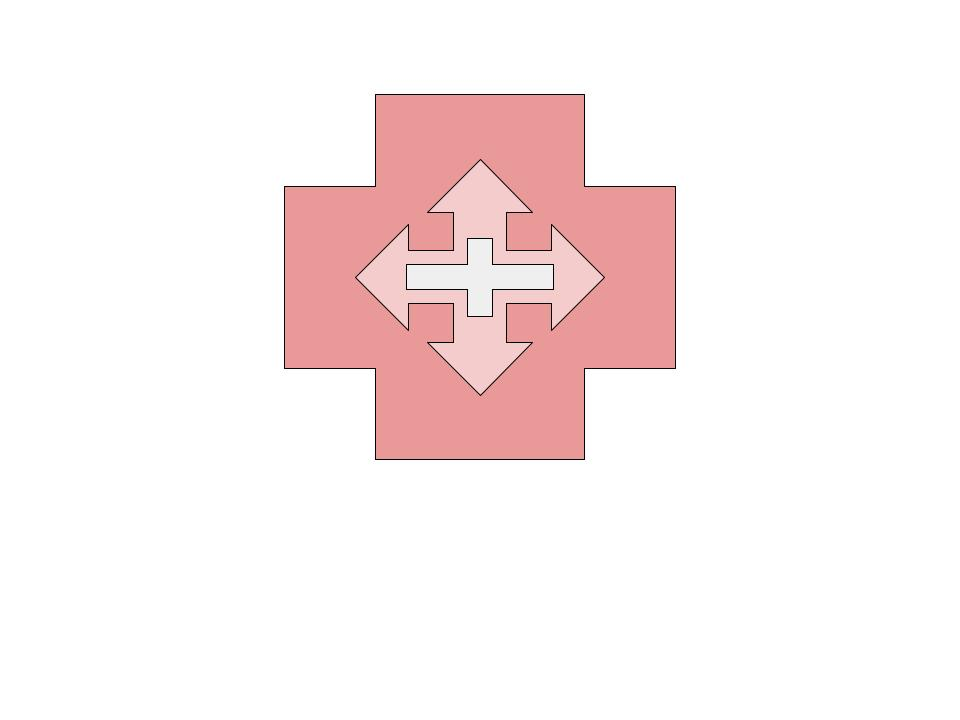

This is a [Next.js](https://nextjs.org) project bootstrapped with [`create-next-app`](https://nextjs.org/docs/app/api-reference/cli/create-next-app).

## Getting Started

First, run the development server:

```bash
npm run dev
# or
yarn dev
# or
pnpm dev
# or
bun dev
```

Open [http://localhost:3000](http://localhost:3000) with your browser to see the result.

You can start editing the page by modifying `app/page.tsx`. The page auto-updates as you edit the file.

This project uses [`next/font`](https://nextjs.org/docs/app/building-your-application/optimizing/fonts) to automatically optimize and load [Geist](https://vercel.com/font), a new font family for Vercel.

## Learn More

To learn more about Next.js, take a look at the following resources:

- [Next.js Documentation](https://nextjs.org/docs) - learn about Next.js features and API.
- [Learn Next.js](https://nextjs.org/learn) - an interactive Next.js tutorial.

You can check out [the Next.js GitHub repository](https://github.com/vercel/next.js) - your feedback and contributions are welcome!

## Deploy on Vercel

The easiest way to deploy your Next.js app is to use the [Vercel Platform](https://vercel.com/new?utm_medium=default-template&filter=next.js&utm_source=create-next-app&utm_campaign=create-next-app-readme) from the creators of Next.js.

Check out our [Next.js deployment documentation](https://nextjs.org/docs/app/building-your-application/deploying) for more details.

# GitYourWorkDone
> Outline a brief description of your project.
> Live demo [_here_](https://www.example.com). <!-- If you have the project hosted somewhere, include the link here. -->

## Table of Contents
* [General Info](#general-information)
* [Technologies Used](#technologies-used)
* [Features](#features)
* [Screenshots](#screenshots)
* [Setup](#setup)
* [Usage](#usage)
* [Project Status](#project-status)
* [Room for Improvement](#room-for-improvement)
* [Acknowledgements](#acknowledgements)
* [Contact](#contact)
<!-- * [License](#license) -->


## General Information
- Provide general information about your project here.
- What problem does it (intend to) solve?
- What is the purpose of your project?
- Why did you undertake it?
<!-- You don't have to answer all the questions - just the ones relevant to your project. -->


## Technologies Used
- Next.js - full-stack React framework for frontend and backend API routes - https://nextjs.org/
- Tailwind CSS – utility-first styling framework for fast UI development - https://tailwindcss.com/
- OpenAI API – AI analysis for assignment parsing and workload estimation - https://openai.com/api/
- Node.js – runtime environment for server functionality - https://nodejs.org/en
- Vercel – deployment and hosting platform - https://vercel.com/


## Features Complete
None yet complete


## Screenshots



## Setup
What are the project requirements/dependencies? Where are they listed? A requirements.txt or a Pipfile.lock file perhaps? Where is it located?

Proceed to describe how to install / setup one's local environment / get started with the project.


## Usage
How does one go about using it?
Provide various use cases and code examples here.

`write-your-code-here`


## Project Status
Project is: _in progress_ 


## Room for Improvement/Features to add
Include areas you believe need improvement / could be improved. Also add TODOs for future development.

Room for improvement:
- Improvement to be done 1
- Improvement to be done 2

Features To do:

DOCUMENT UPLOAD
- Allows students to upload homework or assignment files so the system can extract tasks and deadlines automatically.

KEYWORD/AI PARSING
- Calculates the total time required to complete all upcoming assignments.

WORKLOAD ALERT
- Alerts users when their workload exceeds their planned study time and suggests adjustments.


## Acknowledgements
Give credit here.
- This project was inspired by...
- This project was based on [this tutorial](https://www.example.com).
- Many thanks to...


## Contact
Created by [@flynerdpl](https://www.flynerd.pl/) - feel free to contact me!


<!-- Optional -->
<!-- ## License -->
<!-- This project is open source and available under the [... License](). -->

<!-- You don't have to include all sections - just the one's relevant to your project -->

