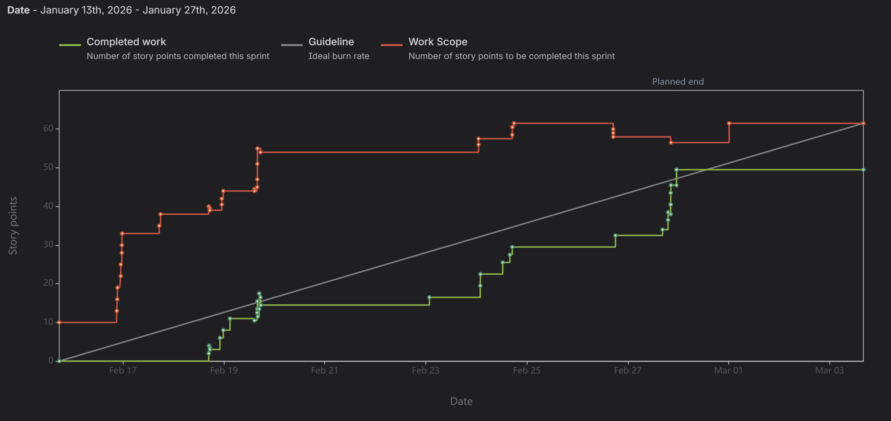
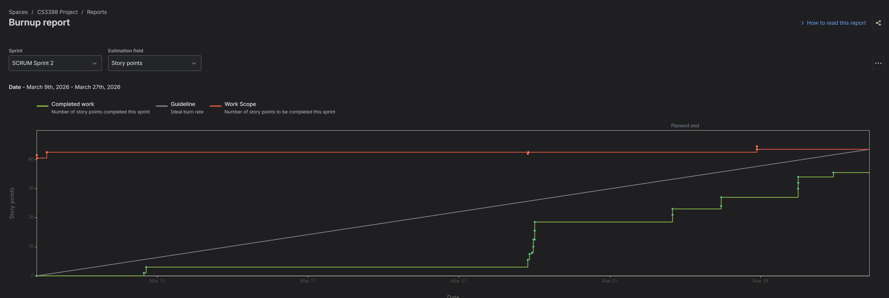

# GitYourWorkDone

## Table of Contents
* [General Info](#general-information)
* [Technologies Used](#technologies-used)
* [Features](#features)
* [Screenshots](#screenshots)
* [Setup](#setup)
* [Usage](#usage)
* [Project Status](#project-status)
* [Room for Improvement](#room-for-improvement)
* [Acknowledgements](#acknowledgements)
* [Contact](#contact)

## Our Team
- Kacin Segovia
- Kyle Kronk
- Isabel Garcia
- Marco Mosqueda

## Project Vision
1. A site that will take downloads of homework to utilize AI to give a potential work time for each assignment as well as an order each assignment should be completed. Based on given workload users will also be alerted when workload exceeds allowed study time based on user study commitments.
2. The site is meant for students and other individuals in need of time management for work tasks.
3. We hope to give people more control over their time and ease their stresses with a strong visualization of their workload.


## Technologies Used
- Next.js - full-stack React framework for frontend and backend API routes - https://nextjs.org/
- Tailwind CSS – utility-first styling framework for fast UI development - https://tailwindcss.com/
- OpenAI API – AI analysis for assignment parsing and workload estimation - https://openai.com/api/
- Node.js – runtime environment for server functionality - https://nodejs.org/en
- MongoDb - Open source document-oriented database platform.

## Screenshots


## Setup
First, run the development server:

```bash
npm run dev
# or
yarn dev
# or
pnpm dev
# or
bun dev
```
Open [http://localhost:3000](http://localhost:3000) with your browser to see the result.

## Features

## Sprint 1

## Contributions


**Marco:** "implementing and designing the logic layer of the application, workload calculations, deadline systems and partial completion logic for assignments as wll as API Route integration & data formatting for the functions."
- Jira Task: Marco - Design and implement a priority logic
  - SCRUM-20, [Bitbucket](https://bitbucket.org/cs3398-enceladus-s26/enchiladas/branch/SCRUM-20-design-and-implement-a-priority)

- Jira Task: Marco - Workload calculation for assignments and availability for study times/break 
  - SCRUM-26, [Bitbucket](https://bitbucket.org/cs3398-enceladus-s26/enchiladas/branch/SCRUM-26-workload-calculation-for-assign)

- Jira Task: Marco - API Route integration & data formatting for the functions 
  - SCRUM-27, [Bitbucket](https://bitbucket.org/cs3398-enceladus-s26/enchiladas/branch/SCRUM-27-api-route-integration-data-form)

  - Jira Task: Marco - Define the Type Script interfaces
  - SCRUM-46, [Bitbucket](https://bitbucket.org/cs3398-enceladus-s26/enchiladas/branch/SCRUM-46-define-the-type-script-interfac)

  - Jira Task: Marco - Implement partial completion Logic to know if an assignment is almost done or not  
  - SCRUM-44, [Bitbucket](https://bitbucket.org/cs3398-enceladus-s26/enchiladas/branch/SCRUM-44-implement-partial-completion-lo)

  - Jira Task: Marco - Schedule/work recalculation 
  - SCRUM-38, [Bitbucket](https://bitbucket.org/cs3398-enceladus-s26/enchiladas/branch/SCRUM-38-schedule-work-recalculatio)

  - Jira Task: Marco - Add "Done" filtering to mark when a work is done  
  - SCRUM-43, [Bitbucket](https://bitbucket.org/cs3398-enceladus-s26/enchiladas/branch/SCRUM-43-add-done-filtering-to-mark-when)

  - Jira Task: Marco - Develop a deadline detection system  
  - SCRUM-45, [Bitbucket](https://bitbucket.org/cs3398-enceladus-s26/enchiladas/branch/SCRUM-45-develop-a-deadline-detection-sy)

**Isabel:** ""

- Jira Task: Isabel - SCRUM-XX  
  - SCRUM-XX, Bitbucket

- Jira Task: Isabel - SCRUM-XX  
  - SCRUM-XX, Bitbucket


## Features Complete
Contributions:
Kacin: "Provided users with full CRUD (Create,Read, Update, and Delete) capabilities for the assignment database that are connected instantly to a MongoDB cluster."

(First 2 tasks created an outline for the later implemented database)
-Jira Task: Kacin - Designed Assignment & Availability Data Schema https://cs3398-enceladus-s26.atlassian.net/browse/SCRUM-29
-Jira Task: Kacin - Validate & Store Assignments in Memory https://cs3398-enceladus-s26.atlassian.net/browse/SCRUM-33
-Jira Task: Kacin - Learn/Set up MongoDB Cluster &  Began Updating Schema https://cs3398-enceladus-s26.atlassian.net/browse/SCRUM-49
-Jira Task: Kacin - API Model/CRUD Examplehttps://cs3398-enceladus-s26.atlassian.net/browse/SCRUM-35 
-Jira Task: Kacin - Implement Router CRUD and Validate https://cs3398-enceladus-s26.atlassian.net/browse/SCRUM-18 
**Kacin:** "Provided users with full CRUD (Create, Read, Update, and Delete) capabilities for the assignment database connected to a MongoDB cluster, enabling assignments to be created, viewed, updated, and deleted through backend API routes."

Next Steps

Kacin:
- User settings with personalization and default settings
- Add proper user input validation along with user authentication
- Connect a simple input interface.

## Screenshots

- Jira Task: Kacin - Designed Assignment & Availability Data Schema  
  - SCRUM-29, https://cs3398-enceladus-s26.atlassian.net/browse/SCRUM-29

- Jira Task: Kacin - Validate & Store Assignments in Memory  
  - SCRUM-33, https://cs3398-enceladus-s26.atlassian.net/browse/SCRUM-33

- Jira Task: Kacin - Learn/Set up MongoDB Cluster & Began Updating Schema  
  - SCRUM-49, https://cs3398-enceladus-s26.atlassian.net/browse/SCRUM-49

- Jira Task: Kacin - API Model/CRUD Example  
  - SCRUM-35, https://cs3398-enceladus-s26.atlassian.net/browse/SCRUM-35

- Jira Task: Kacin - Implement Router CRUD and Validate  
  - SCRUM-18, https://cs3398-enceladus-s26.atlassian.net/browse/SCRUM-18


**Kyle:** "set up the Next.js project and file template structure, implemented workload overload detection including calculation logic, backend API route, and a React UI warning component to notify users when scheduled assignments exceed available study hours."

- Jira Task: Kyle - initialize Next.js project and file template structure  
  - SCRUM-41, [Bitbucket](https://bitbucket.org/cs3398-enceladus-s26/enchiladas/branch/SCRUM-41-Install-nextjs-into-project-directory-add-empty-project-file-template)

- Jira Task: Kyle - design overload calculation rules and edge cases  
  - SCRUM-7, [Bitbucket](https://bitbucket.org/cs3398-enceladus-s26/enchiladas/branch/SCRUM-7-design-overload-rules)

- Jira Task: Kyle - implement overload calculation logic  
  - SCRUM-8, [Bitbucket](https://bitbucket.org/cs3398-enceladus-s26/enchiladas/branch/SCRUM-8-Implement-overload-calculation-logic)

- Jira Task: Kyle - create API route for overload status  
  - SCRUM-9, [Bitbucket](https://bitbucket.org/cs3398-enceladus-s26/enchiladas/branch/SCRUM-9-Create-API-route/service-for-overload-status)

- Jira Task: Kyle - build overload warning UI component  
  - SCRUM-10, [Bitbucket](https://bitbucket.org/cs3398-enceladus-s26/enchiladas/branch/SCRUM-10-Testing-Branch)


## Reports




## Next Steps

Marco:

• Implement this logic with mongodb to display accurate results/ move to live data

• Frontend Component Development to focus on the UI components that reflect the "Overload" and "Priority" math.

• Dynamic Re-scheduling such as moving a task to done or in progress would make the UI immediately triggers to refresh the list.


Isabel:

• 

• 


Kacin:

• Implement user settings with personalization and default configuration

• Add proper user authentication and validation for assignment inputs

• Connect a simple UI interface to the backend CRUD assignment API


Kyle:

• Design document upload flow and supported file types

• Implement backend file upload API route and storage handling

• Build document upload UI component with progress feedback

• Integrate OpenAI API for document parsing and workload estimation

• Create UI for reviewing and editing extracted assignment details

• Add unit tests for upload validation and AI response handling


## Features

## Sprint 2

## Contributions


**Kyle:** "designed and implemented the document upload and AI analysis pipeline, including backend file storage, a frontend upload interface with progress feedback, integration with the OpenAI API for extracting workload estimates, and a review/edit interface for confirming assignment details before saving. Also added validation and testing for upload handling and AI responses."

- Jira Task: Kyle - design document upload flow and supported file types
  - SCRUM-12, [Bitbucket](https://bitbucket.org/cs3398-enceladus-s26/enchiladas/branch/SCRUM-41-Install-nextjs-into-project-directory-add-empty-project-file-template)

- Jira Task: Kyle - design overload calculation rules and edge cases  
  - SCRUM-13, [Bitbucket](https://bitbucket.org/cs3398-enceladus-s26/enchiladas/branch/SCRUM-7-design-overload-rules)

- Jira Task: Kyle - implement overload calculation logic  
  - SCRUM-14, [Bitbucket](https://bitbucket.org/cs3398-enceladus-s26/enchiladas/branch/SCRUM-8-Implement-overload-calculation-logic)

- Jira Task: Kyle - create API route for overload status  
  - SCRUM-15, [Bitbucket](https://bitbucket.org/cs3398-enceladus-s26/enchiladas/branch/SCRUM-9-Create-API-route/service-for-overload-status)

- Jira Task: Kyle - build overload warning UI component  
  - SCRUM-16, [Bitbucket](https://bitbucket.org/cs3398-enceladus-s26/enchiladas/branch/SCRUM-10-Testing-Branch)

  - Jira Task: Kyle - build overload warning UI component  
  - SCRUM-17, [Bitbucket](https://bitbucket.org/cs3398-enceladus-s26/enchiladas/branch/SCRUM-10-Testing-Branch)


## Reports




## Next Steps

Kyle:

• Extend document analysis to support PDF files by extracting text before sending to OpenAI

• Improve AI response validation and error handling to prevent invalid JSON and fallback values (e.g., 0 minutes issue)

• Refactor analysis pipeline to ensure consistent structured output (minutes, due date, title)

• Integrate saved assignments into overload calculation logic (use localStorage as source of truth)

• Build a workload visualization component showing total minutes per upcoming days

• Create a simple bar chart or timeline view of assignments by due date

• Display a weekly workload breakdown (e.g., total minutes per day for next 7 days)

• Add a “time remaining vs required work” visual indicator (progress-style or gauge)

• Highlight overloaded days visually (color-coded red vs green)

• Add ability to delete and edit saved assignments in the UI

• Improve upload UX by showing loading/progress states during analysis


Marco "developed the UI, designed the UI Dashboard layout, UI integration to backend and helped design the UI logic layer updating old functions into newer compatible for mongodb."

Jira Task: Marco - UI Development
- Scrum-53, [Bitbucket](https://bitbucket.org/cs3398-enceladus-s26/enchiladas/branch/SCRUM-55-ui-integration-to-backend)

Jira Task: Marco - UI Dashboard Layout
- Scrum-54, [Bitbucket](https://bitbucket.org/cs3398-enceladus-s26/enchiladas/branch/SCRUM-54-ui-dashboard-layout)

Jira Task: Marco - UI Integration to backend
- Scrum-55, [Bitbucket](https://bitbucket.org/cs3398-enceladus-s26/enchiladas/branch/SCRUM-55-ui-integration-to-backend)

Jira Task: Marco - UI Logic Layer
- Scrum-56, [Bitbucket](https://bitbucket.org/cs3398-enceladus-s26/enchiladas/branch/SCRUM-56-ui-logic-layer) 

Jira Task: Marco - Updating functions to mongodb
- Scrum-66, [Bitbucket](https://bitbucket.org/cs3398-enceladus-s26/enchiladas/branch/SCRUM-66-updating-functions-to-mongodb)

Next Steps:
- Designing the dashboard into a better user friendly layout
- Adding calendar and other user friendly widgets
- Study room/practice if user has time to spare.
- Dashboard sorting & filtering logic (ex. looking at completed tasks or Closest due date, higher priority etc)

